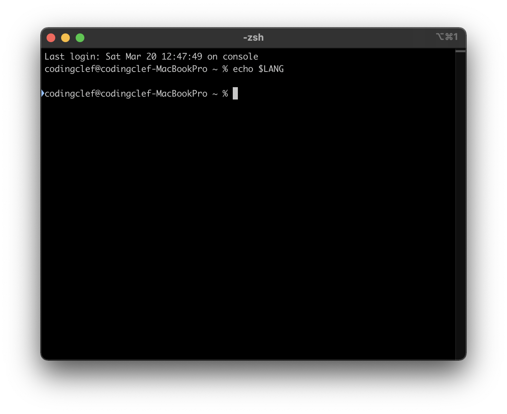

## Gitメッセージを英語に出力する

1. Gitメッセージが英語で出力されない理由

   使用しているShellの言語設定（環境変数）が英語ではないから

   画像のように環境変数で設定されておらず、OSデフォルト言語に表示されるようだ

   

2. どこを修正する？

   Z Shellを使用している場合は「~/.zshrc」を、Teminalの基本Bach Shellを使用している場合は「~/.bash_profile」または、「~/.bashrc」ファイルを修正する

3. zshで修正してみよう

   ```bash
   # ファイルを開いて
   vi ~/.zshrc
   # 環境変数を追加
   export LANG=en_US
   # ファイルを更新
   source ~/.zshrc
   # 更新確認
   echo $LANG
   ```

   

