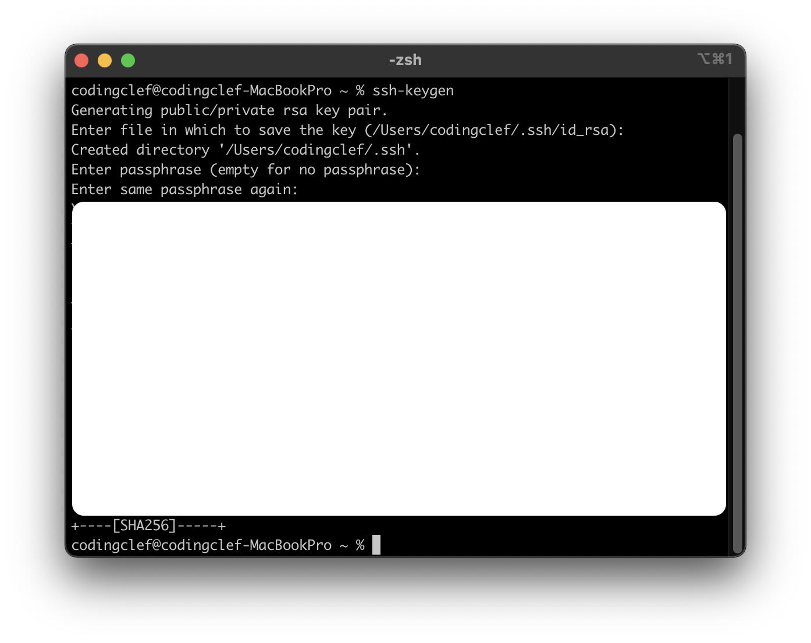
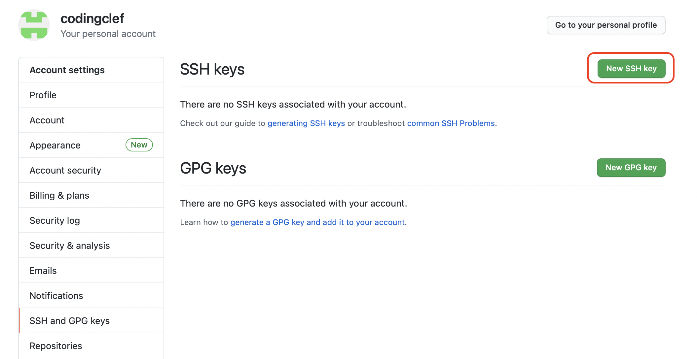

## GitのSSH設定

1. SSHキーの確認

   ```bash
   # 公開キーの確認
   cat ~/.ssh/id_rsa.pub
   # キーが存在しない場合、以下のようなメッセージが出力される
   cat: /Users/codingclef/.ssh/id_rsa.pub: No such file or directory
   ```

2. SSHキーの作成

   以下のコマンドを実行するといくつかのメッセージが表示されるが、全てEnterキーで良い。

   ```bash
   # ssh-keygenにてキー生成
   ssh-keygen
   ```

   

3. SSHキーの生成確認

   もう一度上記1で打鍵したコマンドから生成されたSSHを確認し、コピーする。

   ```bash
   # 公開キーの生成確認
   cat ~/.ssh/id_rsa.pub
   ```

   

4. GithubにSSHキー登録

   アカウントのSettingsで「SSH and GPG keys」を選択し、New SSH keyをクリックする。

   上記3でコピーしたSSHキーを入力し、登録をすれば完了。

   




