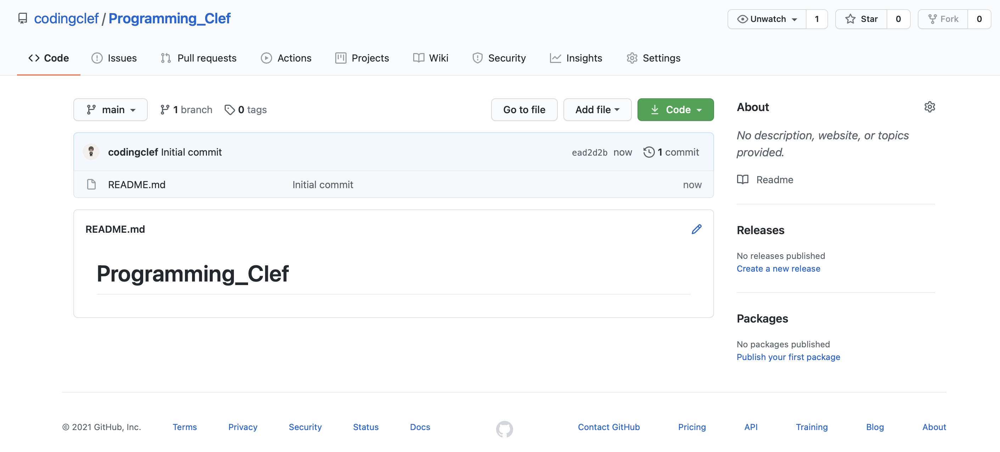

## GithubにCommitをしてみよう

1. 新しいRepositoryを作成する

   

   

2. Teminalを起動し、Githubにコミットしたいファイルやソースがあるディレクトリに移動する。

   ここではテストコミットとしてREADME.mdファイルを修正してみる。

   ```bash
   echo "# Test" >> README.md
   ```

3. Local Directoryを設定する

   git initとは、該当のディレクトリをローカルGitディレクトリと指定するコマンドである。

   ```bash
   git init
   ```

   

4. 上記2番で内容を追加したREADME.mdファイルをaddする

   addコマンドは言葉通り、ファイルを追加するという意味

   ```Bash
   git add README.md
   ```

5. add内容を反映するため、commitをする（ここでは-mでコミットする）

   -m：vimで別途メッセージを作成することなく、インラインで直接コミットメッセージ作成

   ```bash
   git commit -m "コミットメッセージ"
   ```

   -a：addコマンドを使用せず、修正されたファイルに対してadd、commitを行う

   　　ただし、一度もaddしたことないファイルは別途addする必要がある

   ```bash
   git commit -a
   ```

   -am：aとmを

   ```bash
   git commit -am "コミットメッセージ"
   ```

6. ローカルディレクトリとGithubの連結

   上記5の作業にて、ローカルGitにソースがコミットされた

   それの内容をGithubにも反映するにはまず二つのディレクトリを繋げる必要がある

   ```bash
   git remote add origin https://github.com/codingclef/Programming_Clef.git
   ```

   

7. 最後！コミット内容をGithubにpushする

   ※1 画像ではmasterにpushしたが、master/slaveのような差別の意味がある言葉は控えるということで、Githubでもmasterの代わりにmainをデフォルトで使用することに変化があった。筆者も後程mainにコミットし直した。
   ※2 スクリーンショットを撮りながら何回かミスしてしまい、TESTが3回も上書きされた...

   ```bash
   git push -u origin main
   ```


